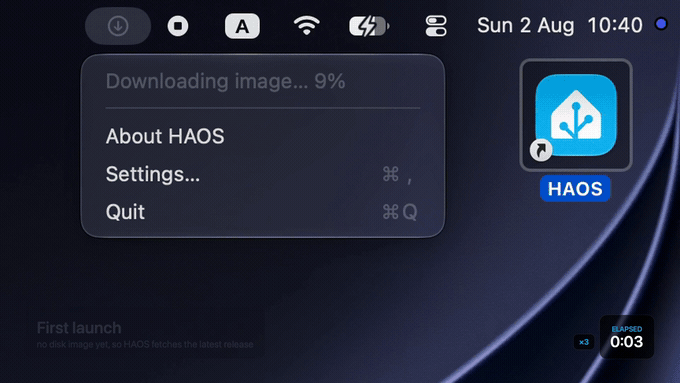

# HAOS

A menu bar app that runs [Home Assistant OS](https://www.home-assistant.io/installation/macos/) in a virtual machine on your Mac, bridged onto your local network.

No Dock icon, no window to keep open — a house icon in the menu bar tells you whether Home Assistant is up, and the VM starts automatically at login.

## Demo

A first launch on a Mac with nothing installed: HAOS fetches the latest Home Assistant OS release, unpacks it, boots the guest, and Home Assistant answers at `homeassistant.local:8123` — just over two minutes, start to finish.



<details>
<summary><b>Full demo</b> — the whole run, a minute long</summary>

The loop above is the two ends of it. Here it is start to finish: the download and unpack in the menu, the guest booting in the console, Home Assistant preparing itself, and the welcome screen it lands on. The clock counts the recording's real elapsed time, and a marker appears whenever a quiet stretch is sped up. (The same cut is in the repo as [`docs/demo.mp4`](docs/demo.mp4).)

https://github.com/user-attachments/assets/f0c7adba-33de-4805-9fd0-e745f56d1ffa

</details>

## Features

- **One-click start.** The VM boots when the app launches; a menu item starts and stops it by hand.
- **Automatic first-run setup.** On first launch the app fetches the latest `haos_generic-aarch64` release from GitHub, unpacks it, and boots it. Nothing to download or convert yourself. The menu's status line follows the whole way — download, unpack, and the minutes the guest then spends installing Home Assistant — and only says *Running* once the web UI actually answers.
- **Real LAN presence.** The guest is bridged onto your physical network via `vmnet.framework`, so it gets an address from your router's DHCP and participates in multicast — which is what mDNS, SSDP and Matter discovery need to find your devices.
- **Stable address.** The vmnet interface ID is persisted, so the guest keeps the same MAC and therefore the same DHCP lease across restarts.
- **A shared folder.** A folder you pick is shared into the guest over virtiofs and mounted as Home Assistant's backups, media or `/share` directory — read-only by default, or writable so backups land in the Finder, and in Time Machine, instead of inside the disk image. See [Shared folder](#shared-folder).
- **Console access.** "Show Console" opens the guest's framebuffer when you need to look at the boot log or use the HA CLI.
- **Clean shutdown.** Quitting presses the guest's power button and waits up to 60 seconds for Home Assistant OS to power off properly before forcing it. Home Assistant OS's generic image ignores a short press out of the box — see [Clean shutdown](#clean-shutdown) for how the app gets around that.
- **Stays awake.** While the VM runs, the app holds a power assertion so an idle host doesn't freeze the guest and drop your automations.

## Requirements

- **macOS 27 or later.** This is a hard floor, not a recommendation — see [Limitations](#limitations).
- **Apple Silicon.** The app boots the `aarch64` build of Home Assistant OS.
- A **network interface that supports bridging** — Wi-Fi or Ethernet. Wired adapters are preferred automatically when both are available.

## Installing

```sh
git clone https://github.com/LeonidEmelianov/HAOS.git
cd HAOS
make install
```

That builds a Release configuration, ad-hoc signs it, installs it to `/Applications`, and launches it. No Apple Developer account is required: `com.apple.security.virtualization` is honored under an ad-hoc signature. Signing can't be skipped entirely, though — an unsigned bundle carries no entitlements and the VM won't start.

If a copy is already running, the script asks it to quit and waits for the guest to shut down cleanly before replacing it.

| Target | |
| --- | --- |
| `make install` | Build, install to `/Applications`, relaunch |
| `make build` | Build and verify only, no install |
| `make uninstall` | Remove the app (leaves your VM data alone) |
| `make dmg` | Build the release `.dmg` |
| `make clean` | Delete build products |

The script accepts `--no-launch` and `--build-only`, and honors `DEST_DIR` and `DEVELOPER_DIR`.

Autostart registers itself only when the app runs from `/Applications`, so a debug build in DerivedData won't quietly add itself to your login items. Turn it off under **System Settings → General → Login Items**.

The first launch triggers two system prompts: one to allow local network access, and a one-time authorization for bridged networking.

On that first boot the guest's console drops into an "emergency console" with a warning that the Home Assistant CLI isn't starting. That's Home Assistant OS being impatient with itself: the Supervisor is still downloading Home Assistant's containers, which takes a few minutes, and the CLI gives up waiting before it's done. Nothing needs doing — the menu says *installing Home Assistant* until the web UI is up.

## Building in Xcode

```sh
open HAOS.xcodeproj
```

Set your development team in the target's Signing & Capabilities tab, then build and run.

Build products go to `~/Library/Caches/HAOS`, deliberately outside the repo — this project is developed in a directory synced by iCloud Drive, where the file provider stamps extended attributes that make `codesign` fail with *"resource fork, Finder information, or similar detritus not allowed"*, and where build intermediates would otherwise be uploaded.

### Project layout

```
HAOS/
  App/       menu bar, console window, about panel, entry point
  Settings/  the Settings window and its grid
  Support/   small shared pieces (errors, sleep assertion, menu items)
  VM/        VMController, VM state, the VMFeature protocol
    Features/DiskImage, Network, SharedFolder, PowerButton, Display
```

`VMController` builds only the bare machine — CPUs, memory, firmware. Everything else the guest has is a `VMFeature`: one folder holding that capability's settings, its host-side work, the devices it adds to the machine, and any UI of its own. Adding a capability means adding a folder and one line in `VMController.features`, not another branch in the controller.

There is **no GitHub Actions workflow**, and can't be one yet: HAOS targets macOS 27, the newest GitHub-hosted runner is `macos-26`, and its Xcode versions ship SDKs no newer than macOS 26.5. You cannot build against an SDK older than the deployment target. Once a macos-27 image exists, a build workflow becomes a few lines.

## Usage

Click the menu bar icon:

| Item | What it does |
| --- | --- |
| *(status line)* | Current state — download progress, Starting…, Running, Stopping… |
| Start Home Assistant | Boots the VM (hidden while something is already in flight) |
| Shut Down | Graceful shutdown (see [Clean shutdown](#clean-shutdown)) |
| Show Console | Opens the guest's display in a window |
| Open Web UI | Opens <http://homeassistant.local:8123> |
| Settings… | CPU cores, memory, disk size and the shared folder |
| Quit | Shuts the guest down, then exits |

The icon is a filled house while the VM is running and a dimmed outline otherwise.

## Settings

CPU count and memory are adjustable and take effect the next time the VM starts. Defaults are **2 cores** and **4 GiB**; the floor is 2 GiB, below which the guest runs out of memory during onboarding. Both values are clamped to what `Virtualization.framework` reports the host allows, so a setting carried over from a bigger machine can't produce an invalid configuration.

### Disk size

The virtual disk is **48 GiB** by default and can be grown, in 16 GiB steps up to 256 GiB, with the **Resize** button. The image is grown right away while the VM is stopped and otherwise the next time it starts; either way Home Assistant OS expands its data partition into the new space on its next boot. A disk can't be made smaller — a raw image can't be cut down without losing the partitions at its end — so sizes below the current one are disabled, as are sizes beyond what's free on the Mac. The file is sparse, so growing it costs nothing until the guest actually writes.

### Shared folder

Off by default. Turn on **Share a folder with Home Assistant** — which asks you for a folder, since there's no default one — and that folder is mounted over one of the Supervisor's directories in the guest:

| Use as | Guest directory | What you get |
| --- | --- | --- |
| Backups *(default)* | `/mnt/data/supervisor/backup` | Every backup Home Assistant writes — manual, automatic, or the one it takes before an update — lands on the Mac, deleting one in the Home Assistant UI deletes the file here, and a backup you drop into the folder shows up in Home Assistant, ready to restore. This use needs **read-only off**: the Supervisor unpacks a backup into a temporary directory next to the `.tar` before restoring, so on a read-only share backups are listed but can't be restored, and restoring needs as much free space in the folder as the backup itself. |
| Media | `/mnt/data/supervisor/media` | The folder shows up in Home Assistant's media browser. |
| Share | `/mnt/data/supervisor/share` | The folder shows up as `/share`, which add-ons read — and write, with read-only off. |

**Read-only** is on by default: Home Assistant sees the folder's contents but can't write to it, so a share can't rewrite or delete files on the Mac. Turn it off for the cases that need writing — anything to do with backups, including restoring one, or an add-on that writes into `/share`.

Two things make that work, both applied the next time the VM starts:

- The folder is offered to the guest as a **virtiofs** share tagged `haos-shared`, read-only unless you say otherwise.
- `systemd.mount-extra=haos-shared:<guest directory>:virtiofs:ro,nofail` is added to the guest's kernel command line (`rw` when read-only is off), which mounts the share early enough that Docker and the Supervisor see it. The host side is what actually enforces the read-only share; the mount option only keeps the guest from asking for more.

Nothing in Home Assistant OS mounts a virtiofs share on its own, and its root filesystem is read-only, so the kernel command line is the only durable place to ask for the mount. It lives in `cmdline.txt` on the image's FAT boot partition — the app edits it by attaching the image while the VM is stopped, and the RAUC update hook carries the file across Home Assistant OS updates. `nofail` keeps a guest that boots without the share from stalling.

Whatever the guest already keeps in that directory isn't moved or deleted; it's hidden underneath the mount, and reappears if you turn sharing off. The guest directory is a fixed list rather than a free path on purpose — mounting over the Home Assistant configuration would hide the running instance.

### Clean shutdown

*Shut Down* and *Quit* ask the guest to power off by pressing its power button (`VZVirtualMachine.requestStop()`), then wait up to 60 seconds before forcing it. There's a catch: the `generic-aarch64` image is built for bare-metal boards, where a bumped button mustn't take the house down, so its systemd-logind ignores a short press and powers off only on a long one — and a long press is not something the host can send.

So the app hands the guest a logind drop-in that turns the short press back on, the same way it hands it the shared folder: a one-file directory on the Mac (`~/Library/Application Support/HAOS/logind.conf.d/haos.conf`, containing `HandlePowerKey=poweroff`) is offered as a read-only virtiofs share tagged `haos-logind`, and `systemd.mount-extra=haos-logind:/run/systemd/logind.conf.d:virtiofs:ro,nofail` on the kernel command line mounts it before logind starts. With that, a fresh guest is off about 15 seconds after the request. Without it — say, a guest started by another tool — the request is ignored and the 60-second force stop is what ends it.

## Data layout

| Path | Contents |
| --- | --- |
| `~/Library/HAOS/HAOS.img` | The guest disk image |
| `~/Library/Application Support/HAOS/NVRAM` | EFI variable store |
| `~/Library/Application Support/HAOS/MachineIdentifier` | VM machine identifier |
| `~/Library/Application Support/HAOS/BridgedInterfaceID` | vmnet interface UUID (keeps the MAC stable) |
| `~/Library/Application Support/HAOS/logind.conf.d/` | The logind drop-in shared into the guest (see [Clean shutdown](#clean-shutdown)) |

The disk image is created at a 48 GiB virtual size (adjustable in Settings) — Home Assistant expands its data partition to fill the disk on boot, and the Supervisor's containers don't fit in the ~6 GiB the stock image ships with. The file stays sparse on APFS, so it only occupies what the guest has actually written.

To start over, quit the app and delete both directories.

## Limitations

**macOS 27 or later is required.** Bridged `vmnet` used to need root or the Apple-gated `com.apple.vm.networking` entitlement. macOS 26 lifted that for apps holding the ordinary virtualization entitlement, which is what lets this app bridge in-process instead of shipping a privileged helper. The deployment target is set to 27 to stay on supported ground; there is no fallback path for older systems.

**USB devices are not supported.** You cannot pass a Zigbee, Z-Wave or Matter USB stick through to the guest. `VZUSBDeviceConfiguration` requires a paid Apple Developer account to sign against, and it isn't wired up here regardless. Integrations that reach your devices over the network work fine — the bridged setup is specifically built for that — but anything needing a physical dongle will not. Use a network-attached coordinator (a Zigbee/Z-Wave-to-Ethernet bridge, or SkyConnect over a USB-to-IP server) instead.

**Bridged mode only.** There is no NAT/shared-networking fallback. A start waits up to a minute for an interface with an active link — the app launches at login, often before Wi-Fi has associated — and begins the moment configd reports the link up, so the wait costs nothing once the network is there. An automatic start retries a few times beyond that, but with no usable interface the VM won't start.

**One VM, one image.** No snapshots, no multiple instances, no UTM import, and the image is never updated in place — Home Assistant updates itself from inside the guest, as usual.

**Apple Silicon only.** Intel Macs are not supported.

## Prior art

[IngmarStein/havm](https://github.com/IngmarStein/havm) is a more featureful CLI-driven take on the same idea, with USB passthrough, NAT networking, UTM import and a Homebrew formula. HAOS is deliberately smaller: a menu bar app with one job and no configuration file.

## License

MIT — see [LICENSE](LICENSE).

Home Assistant and Home Assistant OS are projects of the [Open Home Foundation](https://www.openhomefoundation.org/); this app only downloads and boots their published images and is not affiliated with them.
